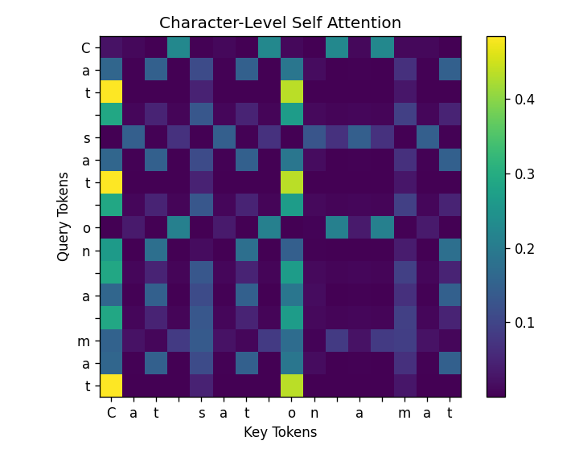

# Attention Weight Visualizer

A small Python project for visualizing character-level self-attention weights.

The app takes text, builds a character vocabulary, creates token embeddings,
computes scaled dot-product attention, and renders the attention weights as a
heatmap.

## Example Output

This is a non-trained attention heatmap. The weights come from randomly
initialized embeddings and projection matrices, so the pattern is useful for
understanding the mechanics of attention rather than interpreting a trained
model.



## Project Structure

```text
app.py                # Application entry point
assets/
  non_trained_attention_heatmap.png
src/
  __init__.py         # Marks src as a Python package
  pipeline.py         # Wires tokenization, embeddings, and attention together
  tokenizer.py        # Builds vocabulary and converts text to token ids
  embeddings.py       # Creates embedding matrices and looks up token embeddings
  attention.py        # Computes attention weights
  visualization.py    # Plots attention weights as a heatmap
```

## Import Flow

The project keeps imports one-directional:

```text
app.py            ->  src.pipeline
app.py            ->  src.visualization
src.pipeline.py   ->  src.tokenizer
src.pipeline.py   ->  src.embeddings
src.pipeline.py   ->  src.attention
```

`app.py` is the only file that runs the full program. The lower-level modules
provide focused helpers and do not need to know about plotting or app startup.

## Installation

```bash
python -m venv .venv
source .venv/bin/activate
pip install -r requirements.txt
```

## Usage

```bash
python app.py
```

By default, the visualizer uses:

```python
"Cat sat on a mat"
```

You can change the default text and embedding dimension in `src/pipeline.py`.

## Requirements

- Python 3.10+
- NumPy
- Matplotlib
